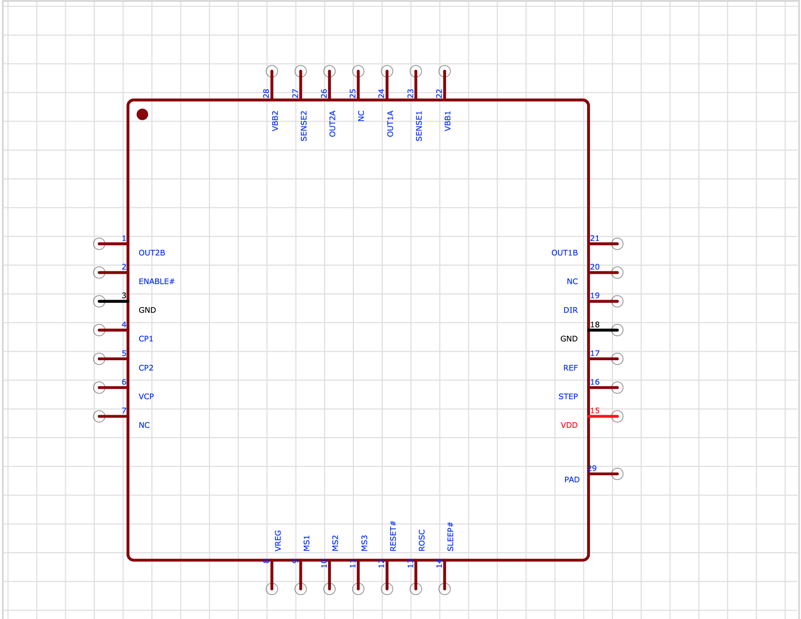
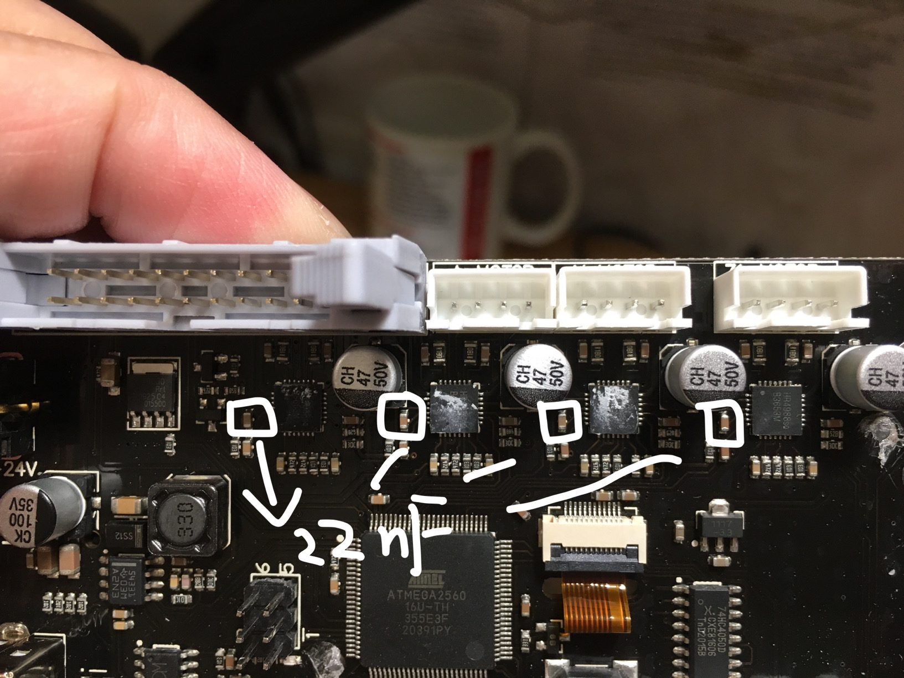
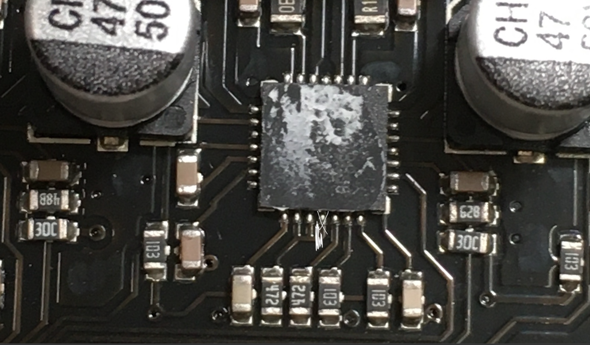
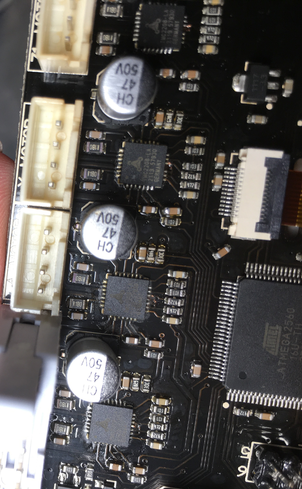
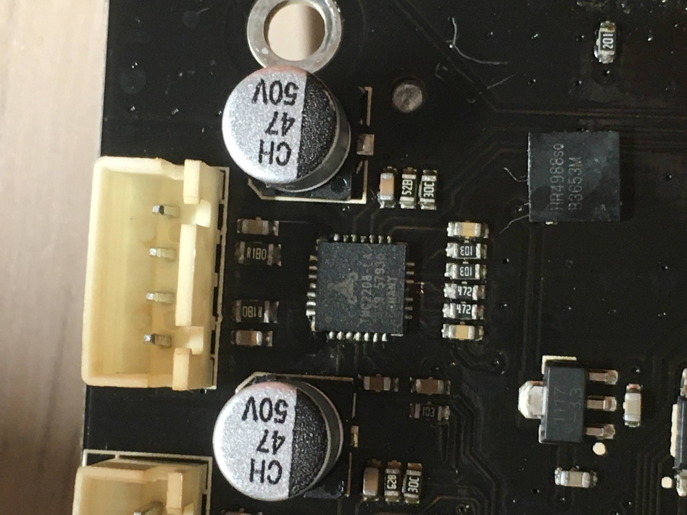

# WeedoTINA2-TMC2208-Hack
Repos for hacks on Weedo TINA2 3d printer

# HR4988(A4988) Stepper Driver Details

Microstepping of original board
|MS1|MS2|MS3|Microstep Resolution|Excitation Mode|
|---|---|---|---|---|
|H|H|H|1/16 Step|4W1-2 Phase|

MS1/MS2/MS3 are connected together on board through a 4.7k resister.All three pins are HIGH which shows a microstepping of 1/16 step.

# TMC2208 Stepper Driver Details
pinout(Top View)

Microstepping of original board
|MS1|MS2|MS3(cut trace)|Microstep Resolution|
|---|---|---|---|
|H|H|DIAG pin|1/16 Step|

# Hack Details
1. Replace on board HR4988 chips with TMC2208 stepper drivers.

2. Replace capacitor between CP0&CP1 from 10nF(HR4988) to 22nF(TMC2208)

3. Cut the trace of MS3 and disconnect it from MS1&MS2.

4. Done

# SMT
Any phone repair shop should have the necessary tools to change on-board HR4988 chips.

# Firmware changes
I've put pre-compiled hex firmware file in the release.Theoretically speaking the firmware need to be updated to accommodate for the changes(X/Y/Z/E Driver Type changes in firmware).

Or if you don't want to update the firmware, the machine should still work even with factory firmware.

# IDEAs
Thanks to the inspirations of @Drunk Engineer
https://www.youtube.com/watch?v=8xod3NARpvE
[How to replace soldered A4988 with Ender 3]
